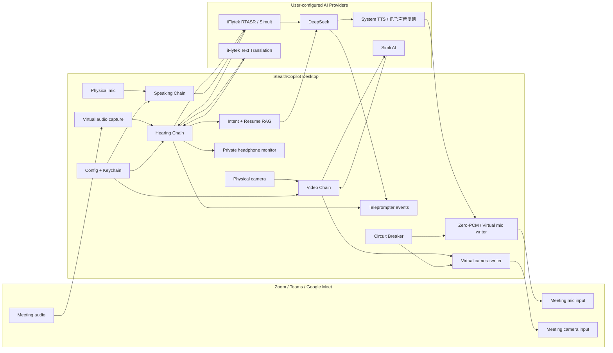

# StealthCopilot

> 面向跨境求职者、远程面试和多语言表达场景的开源桌面 AI Copilot。

StealthCopilot 不是一个普通的字幕工具，也不是一个只会生成答案的聊天窗口。它是一套围绕真实视频面试构建的本地桌面工作站：听懂面试官的问题，结合你的简历生成回答建议，将你的母语表达转换为自然的目标语言语音，并在需要时把视频画面与语音保持同步。

核心目标很简单：让候选人在高压面试中保留思考能力、表达能力和隐私边界。

[](LICENSE)
[](#平台支持)
[](#技术栈)

---

## 一句话介绍

StealthCopilot 是一个运行在 macOS / Windows 上的开源桌面面试辅助系统，通过三条实时管道完成：

- **听力链**：面试官语音 -> RTASR 实时转写 -> 机器翻译字幕 / 耳机译文播报 -> 意图识别 -> 简历 RAG -> AI 回答建议
- **说话链**：你的母语语音 -> 语音翻译 -> 可选润色 -> 默认音色或个人复刻音色 TTS -> 虚拟麦克风
- **视频链**：摄像头画面 -> 口型同步服务 -> A/V 时间戳对齐 -> 虚拟摄像头

同时提供一个只面向用户自己的提词窗，用于显示字幕、回答建议和降级状态。

---

## 为什么做它

跨境面试里，候选人经常不是输在能力，而是输在实时表达成本：

- 听懂问题需要时间，组织英文回答也需要时间。
- 简历经历很多，但高压环境下很难快速调取最相关的项目。
- 语音翻译工具通常只解决“翻译”，不解决“面试回答质量”。
- 普通 AI 聊天窗口容易打断工作流，也无法和会议软件的麦克风、摄像头链路真正整合。
- 云端 SaaS 往往要求上传敏感简历、录音或视频，隐私边界不可控。

StealthCopilot 的设计出发点是：把听、想、说、看四件事串成一个低延迟桌面系统，而不是让用户在多个网页和工具之间来回切换。

---

## 核心能力

| 能力 | 说明 |
|---|---|
| 实时听译字幕 | 捕获会议音频，通过讯飞 RTASR 实时语音转写输出源语言文本，最终句子再调用讯飞机器翻译文本接口输出目标语言文本；ASR、翻译、字幕、监听和回答生成通过内部队列解耦。 |
| 耳机译文播报 | 将面试官语音翻译后的目标语言文本转成系统语音，播放到面试者本地监听输出，不进入会议麦克风。 |
| 简历 RAG 回答建议 | 本地解析简历、生成 embedding、检索最相关片段，再由 DeepSeek 流式生成回答建议。 |
| 追问上下文 | 对面试官输入做 question / followup / statement 分类，追问场景携带最近对话历史。 |
| 母语到目标语言语音 | 本地 VAD 检测用户说话结束，使用讯飞同传得到母语文本和目标文本，再由可选润色链处理，最后通过默认音色或讯飞声音复刻流式 TTS 输出到虚拟麦克风。 |
| Zero-PCM 静音保护 | 在 TTS 首帧到达前持续写入静音块，降低母语语音泄漏到会议麦克风的风险。 |
| 口型同步视频链 | 通过 Simli AI Provider 输出口型同步画面，并通过 A/V ring buffer 做时间戳对齐。 |
| 云端异常熔断 | 当云端链路异常时，系统切换到本地直通模式，优先保证面试不中断。 |
| 安全存储 | API Key 存储在 macOS Keychain / Windows Credential Manager，不写入明文配置。 |
| 开源可审计 | 客户端 AGPL-3.0 开源，关键链路、降级策略和数据流都可审计。 |

---

## 产品架构

StealthCopilot 采用本地桌面 App + 可插拔 Provider 的架构。UI、配置、安全存储、音视频路由和降级控制都在本地运行；第三方服务只承担翻译、LLM、TTS 或口型同步等专业能力。



### 1. 听力链

```text
会议音频
  -> 虚拟声卡捕获
  -> 讯飞 RTASR 实时语音转写（只启用转写）
  -> 句子边界缓冲（final / 空闲超时 / 标点边界）
      -> transQueue: 讯飞机器翻译文本接口
          -> dst: hearing:subtitle / hearing:step -> 提词窗字幕
          -> dst: ttsQueue -> 本地 TTS / 系统语音 -> 面试者耳机
      -> src: 意图识别（question / followup / statement）
          -> question / followup: 简历 RAG + DeepSeek 流式回答 -> answer:token
          -> statement: 只显示字幕，不触发回答
```

设计重点：

- `translation.Provider` 返回 `DualResult` 流，`SrcText` 用于意图识别和 RAG，`DstText` 用于字幕和耳机播报；“三个渠道”是提词窗字幕、耳机监听、回答建议三个业务输出，不是三个独立的 Go channel。
- `processLoop` 用句子缓冲处理讯飞 interim/final 结果：final 直接 flush，interim 遇到空闲超时或前置标点边界也会切句，避免短问句卡在缓冲里。
- 翻译和 RAG 并行处理：`transQueue` 负责文本翻译、字幕和监听，RAG 回答在独立 goroutine 中流式生成，不让字幕等待回答生成。
- 目标语言译文分成两路：视觉字幕进入提词窗，最终译文的系统语音播报进入面试者本地监听输出；这一路和会议虚拟麦克风隔离，避免被面试官听到。
- 如果同传 Provider 返回译文音频 PCM，监听链路可直接播放 Provider 音频；否则对最终译文走本地系统语音播报。
- RAG 使用面试官原文 `src_text` 检索，减少二次翻译造成的语义损耗。
- DeepSeek 采用流式输出，提词窗逐 token 渲染；同一面试 session 的问答历史会保存到本地 `sessions.db`，后续 question / followup 会携带最近 N 轮历史上下文（默认 5 轮，可在高级设置调整）。
- 设置面板提供「历史会话」Tab，可查看每场面试的问答详情并删除已结束会话；历史数据只保存在本机。

### 2. 说话链

```text
物理麦克风
  -> 本地 VAD（静音阈值可调，长段自动切片）
  -> segmentQueue
      -> 讯飞同传 SpeakProvider（ASR + 翻译）
      -> ResultStage / 可选 DeepSeek 润色
      -> 句子切分
      -> ttsQueue
          -> 默认音色或讯飞声音复刻流式 TTS
          -> Zero-PCM -> 首个 TTS chunk 原子切换 -> 虚拟麦克风
```

设计重点：

- VAD 检测说话结束后再触发翻译，避免截断语义；超过上限的语音段会按 PCM 时长拆成多个片段，避免单次同传请求过长。
- `SpeakProvider` 对完整语音段返回 `SrcText` / `DstText`，同语言场景可把原文直接作为目标文本；无语音、无译文和服务错误会走不同前端错误事件。
- 翻译后的目标文本先经过可插拔 `ResultStage`，再按句子拆分进入 `ttsQueue`，让长回答可以边合成边输出。
- TTS Provider 可选默认音色或个人复刻音色：默认音色走系统 TTS + ffmpeg 转成 24kHz mono PCM；个人复刻音色走讯飞声音复刻流式 TTS，只有训练完成并拿到 Asset ID 才启用。
- 虚拟麦克风 writer 有 `idle -> Zero-PCM -> TTS` 三态：VAD 触发后先写静音，首个 TTS chunk 到达时原子切换到真实音频，TTS 结束后回到 idle。
- TTS 音频按 PCM 时钟节拍写入虚拟麦克风，同时可通过 `AudioSink` 喂给视频链做口型同步。
- 润色为可选开关，用户可在“低延迟”和“高质量表达”之间取舍；润色失败时保留翻译原文，不中断说话链。

### 3. 视频链

```text
物理摄像头
  -> Simli AI LipSync Provider
  -> A/V Ring Buffer 时间戳对齐
  -> 虚拟摄像头
```

设计重点：

- LipSync Provider 可插拔，当前接入 Simli AI，后续可替换为自营或其他服务。
- Ring Buffer 用音频和视频 PTS 做对齐，补偿云端处理延迟。
- Simli 未配置或启动失败时，视频链降级为摄像头直通。

### 4. 熔断与降级

面试场景里，最坏的体验不是“AI 不够聪明”，而是会议中断。因此 StealthCopilot 把降级作为一等能力：

- 云端口型同步不可用时，摄像头直通。
- TTS 或翻译失败时，停止当前输出并提示用户。
- 熔断器通过心跳和视频延迟触发状态切换。
- 前端提词窗显示熔断状态，用户可手动触发紧急降级。

---

## 同类产品对比优势

| 维度 | 普通字幕工具 | 普通 AI 面试助手 | 云端面试 SaaS | StealthCopilot |
|---|---|---|---|---|
| 实时字幕 | 有 | 通常没有 | 有 | 有 |
| 简历上下文回答 | 没有 | 有，但常需手动复制 | 取决于平台 | 本地简历 RAG |
| 语音输出 | 没有 | 没有 | 部分支持 | 虚拟麦克风链路 |
| 视频口型同步 | 没有 | 没有 | 部分支持 | Provider 化视频链 |
| 会议软件集成 | 弱 | 弱 | 平台绑定 | 通过虚拟麦克风/摄像头接入 |
| 隐私边界 | 音频上云 | 文本上云 | 数据集中托管 | 客户端开源，简历本地索引 |
| 可扩展性 | 低 | 低 | 受 SaaS 限制 | Go Provider 接口可替换 |
| 降级策略 | 少 | 少 | 黑盒 | 本地熔断与直通 |

StealthCopilot 的差异不是“多接几个 API”，而是把面试过程拆成稳定的本地实时系统：音频、视频、AI 回答、安全存储、降级策略和前端状态展示都在一个桌面应用里协同工作。

---

## 典型使用场景

- 跨境技术面试：中文思考，英文表达，实时获得基于简历的回答提示。
- 英文口语不稳定但技术能力强的候选人：降低表达门槛，保留真实能力展示。
- 多语言远程沟通：快速听懂对方语言，并输出更自然的目标语言表达。
- 面试复盘和模拟练习：用同一套链路训练回答组织、语言方向和简历素材调用。

---

## 平台支持

| 平台 | 状态 | 说明 |
|---|---|---|
| macOS | 支持开发与构建 | Wails + Go + Vue，支持 ContentProtection 与系统依赖检测。 |
| Windows | 支持构建目标 | 使用 Windows 虚拟声卡/摄像头方案，部分设备链路需要实机验证。 |
| Linux | 暂不作为主要目标 | 当前重点是视频会议面试中最常见的 macOS / Windows 桌面环境。 |

---

## 快速开始

### 1. 准备环境

开发环境需要：

- Go 1.23+
- Node.js 20+
- Wails CLI v2
- macOS: BlackHole 或可用虚拟声卡
- Windows: VB-Cable 或可用虚拟声卡
- 可选: ffmpeg，用于音视频设备采集/写入相关能力
- 可选: Python3 + sentence-transformers，用于本地简历 embedding

安装 Wails CLI：

```bash
go install github.com/wailsapp/wails/v2/cmd/wails@latest
```

安装前端依赖：

```bash
cd stealthcopilot/frontend
npm ci
```

### 2. 开发运行

在仓库根目录执行：

```bash
make dev
```

### 3. 生产构建

```bash
make build        # 当前平台
make build-mac    # macOS arm64
make build-win    # Windows amd64
```

### 4. 质量检查

```bash
make lint
make test
```

---

## 应用内使用流程

### 第一步：配置服务密钥

首次启动后进入设置向导，按需配置：

| 服务 | 用途 | 是否必需 |
|---|---|---|
| 讯飞开放平台 | RTASR 实时语音转写、同声传译、机器翻译文本接口 | 听力/说话链必需 |
| DeepSeek | 意图识别、回答生成、可选润色 | 回答建议必需 |
| 讯飞声音复刻 | 训练个人音色并提供克隆音色 TTS | 可选增强；未复刻时说话链使用默认音色 |
| Simli AI | 视频口型同步 | 视频口型同步必需，可降级为摄像头直通 |

密钥通过系统安全存储保存：

- macOS: Keychain
- Windows: Credential Manager

### 第二步：导入简历

支持 PDF / DOCX 简历。应用会在本地提取文本、分块、生成 embedding，并写入本地 SQLite 向量库。面试过程中，RAG 只检索当前激活简历。

### 第三步：绑定会议设备

在 Zoom / Teams / Google Meet 中选择：

- 麦克风：StealthCopilot 对应虚拟麦克风或系统配置的虚拟声卡
- 摄像头：StealthCopilot 对应虚拟摄像头或系统配置的虚拟摄像头

### 第四步：启动管道

在 Dashboard 中可分别启动：

- 听力链：实时字幕和回答建议
- 说话链：母语语音转目标语言语音
- 视频链：口型同步或摄像头直通

也可以使用“一键启动全部”按顺序启动视频链、说话链和听力链。

---

## 配置项概览

| 配置区域 | 内容 |
|---|---|
| 服务密钥 | 讯飞 RTASR、讯飞机器翻译、讯飞声音复刻、DeepSeek、Simli AI 连接信息与连通性测试 |
| 语言 | 听力链源语言/目标语言，说话链输入语言/输出语言 |
| 设备 | 虚拟声卡、物理麦克风、物理摄像头、虚拟摄像头 |
| 监听 | 面试者耳机输出设备、译文播报开关、播报音量和语速 |
| 简历 | 上传、删除、激活简历，本地索引状态 |
| 提词窗 | 透明度、字号、位置、显示状态 |
| 高级 | RAG Prompt、说话润色 Prompt、润色开关 |

---

## 技术栈

| 层 | 技术 |
|---|---|
| 桌面壳 | Wails v2 |
| 后端 | Go |
| 前端 | Vue 3 + TypeScript + Vite |
| 样式 | Tailwind CSS |
| 本地存储 | JSON config + SQLite |
| 安全存储 | go-keyring |
| ASR/文本翻译 | Provider 化，听力链默认讯飞 RTASR + 讯飞机器翻译文本接口，说话链默认讯飞同声传译 |
| LLM | OpenAI-compatible Provider，默认 DeepSeek |
| TTS | Provider 化，默认系统音色；个人复刻音色可切换到讯飞声音复刻流式 TTS |
| 口型同步 | Provider 化，默认 Simli AI，可降级直通 |
| 简历向量 | Provider 化，默认 multilingual-e5-small + sentence-transformers |
| 工程化 | Makefile + golangci-lint + ESLint + Husky + Commitlint |

---

## 目录结构

```text
.
├── .github/                  # GitHub Actions
├── .husky/                   # Git hooks
├── docs/                     # VitePress 文档站
├── openspec/                 # OpenSpec 规格与历史变更
├── stealthcopilot/
│   ├── app.go                # Wails App 生命周期
│   ├── app_bindings.go       # 暴露给前端的 Wails bindings
│   ├── frontend/             # Vue 3 前端
│   ├── internal/
│   │   ├── audio/            # 音频捕获与虚拟麦克风
│   │   ├── circuit/          # 熔断器
│   │   ├── config/           # 配置与 Keychain
│   │   ├── hearing/          # 听力链
│   │   ├── llm/              # OpenAI-compatible 回答生成与润色
│   │   ├── rag/              # RAG 检索
│   │   ├── resume/           # 简历管理与向量库
│   │   ├── speaking/         # 说话链
│   │   ├── translation/      # RTASR 与文本翻译 Provider
│   │   ├── tts/              # TTS Provider
│   │   ├── ui/               # 提词窗与防录屏能力
│   │   └── video/            # 视频链与虚拟摄像头
│   └── scripts/
│       └── embed.py          # sentence-transformers embedding bridge
└── Makefile
```

---

## 开发规范

常用命令：

```bash
make dev          # 启动 Wails 开发模式
make build        # 构建当前平台 App
make lint         # Go + 前端 lint
make test         # Go race test + coverage
make docs         # 启动文档站
make docs-build   # 构建文档站
```

提交规范：

```bash
git add <files>
make commit
```

项目使用 Conventional Commits，示例：

```text
feat(hearing): add xunfei realtime translation provider
fix(video): keep camera passthrough when lip sync provider is unavailable
docs(readme): expand architecture and usage guide
```

---

## 安全与隐私

StealthCopilot 的隐私原则：

- API Key 不写入明文文件。
- 简历文件和向量索引保存在本地。
- 配置与密钥读取由本地后端统一管理。
- 第三方服务只接收实现功能所必需的数据。
- 客户端代码开源，用户可以审计数据流。

需要注意：翻译、LLM、TTS 和口型同步依赖第三方服务时，对应音频、文本或视频数据会发送给用户配置的服务商。请在生产使用前确认这些服务的隐私政策与合规要求。

---

## 当前工程状态

项目已具备完整桌面应用骨架、三条管道的核心实现、设置向导、提词窗、配置存储、RAG 本地索引、CI、lint 和测试入口。

生产部署前建议完成：

- 做真实面试设备联调：当前耳机译文播报通过系统语音播放到 OS 默认输出，生产使用时应将系统默认输出切到耳机；如需强制指定任意硬件输出，需要进一步接入平台原生音频路由。
- 使用真实讯飞 / DeepSeek / 讯飞声音复刻 / Simli 账号做端到端联调。
- 在 macOS 和 Windows 实机验证虚拟麦克风、虚拟摄像头、会议软件设备选择。
- 验证不同会议软件的屏幕共享、防录屏和提词窗行为。
- 根据目标市场补充安装包签名、公证、自动更新和错误上报。

---

## 路线图

| 阶段 | 目标 |
|---|---|
| Desktop MVP | 完整设置向导、听力链、RAG 回答建议、提词窗 |
| Voice Pipeline | VAD、说话链、TTS、虚拟麦克风、Zero-PCM 保护 |
| Video Pipeline | LipSync Provider、虚拟摄像头、A/V 对齐、熔断直通 |
| Production Hardening | 双平台签名、安装包、真实会议软件兼容矩阵、遥测与崩溃诊断 |
| Provider Marketplace | 支持更多 LLM、TTS、翻译和口型同步 Provider |

---

## 许可证与商业授权

本项目以 **AGPL-3.0** 开源，并提供商业授权选项。

- 个人学习、研究和开源场景：遵守 AGPL-3.0。
- 闭源二次分发、商业集成、白标交付：请联系获取商业授权。

商业授权联系：**zhaoyta@gmail.com**

---

## 相关文档

- [架构说明](docs/architecture.md)
- [快速开始](docs/guide/index.md)
- [API Key 配置](docs/guide/api-keys.md)
- [隐私说明](docs/guide/privacy.md)
- [贡献指南](CONTRIBUTING.md)
